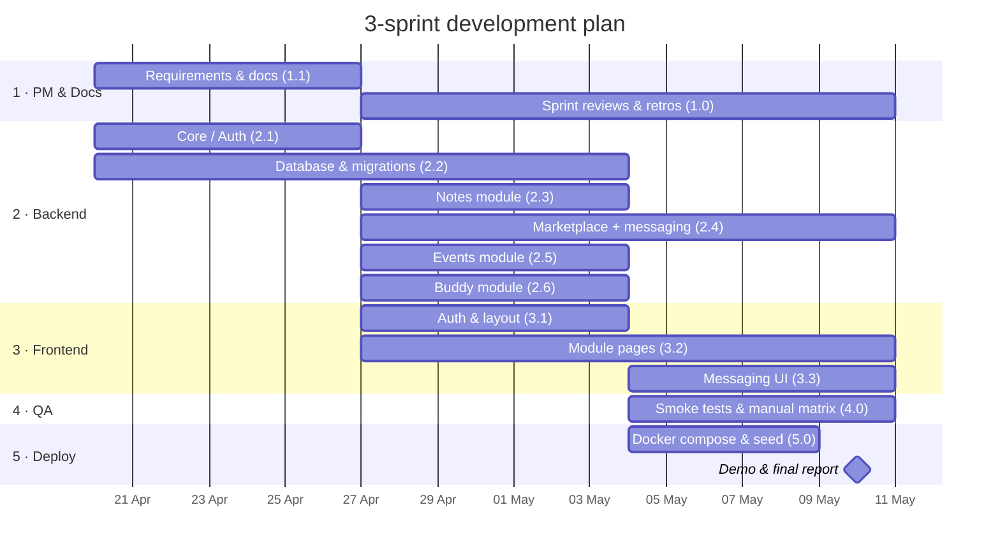
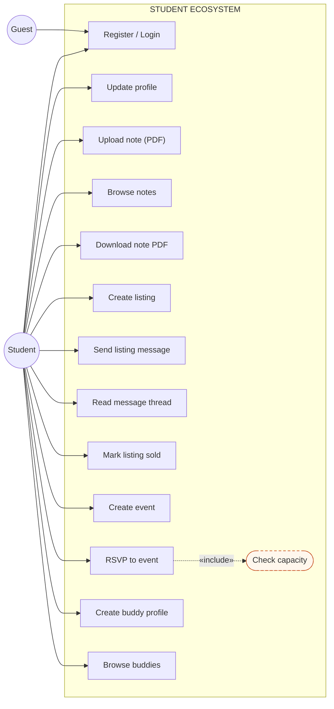
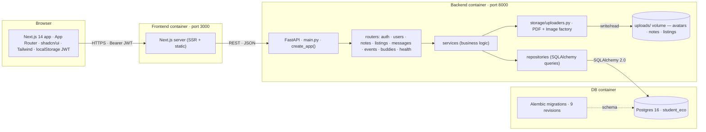
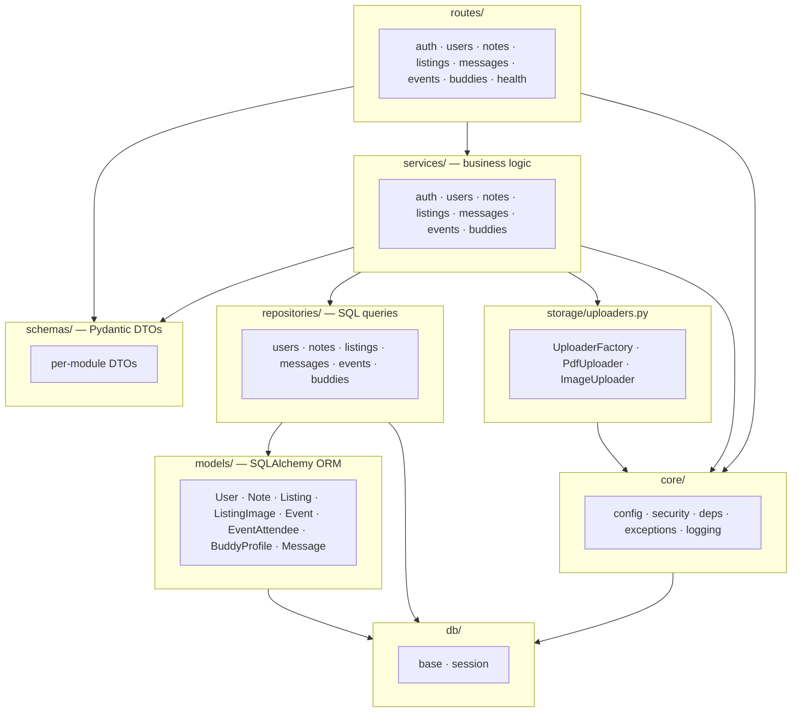
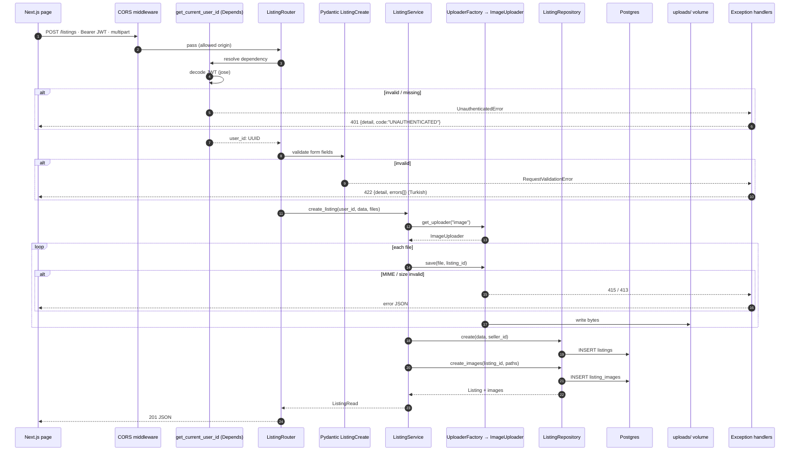
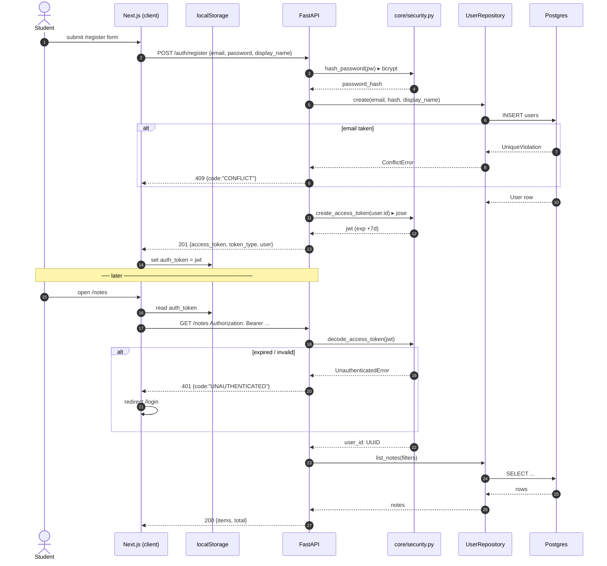
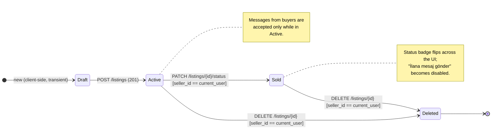

# Student Ecosystem — A Unified Digital Platform for Academic and Social Integration

**Research Project Proposal (TÜBİTAK 1001 Format) — Completed**

Ankara Yıldırım Beyazıt University · Department of Computer Engineering
CENG306 — Software Engineering · Spring 2025–2026

**Group 8:** Yavuz Selim Çanakcı · Selim Çenteli · Ali Burak Kayaat · Kaan Yurtseven · Ruslan Ibragimov

May 2026

---

This document is the completed Project Description for the Student Ecosystem proposal. It fills the five placeholder sections that were blank in the original draft PDF — §1.2 Abstract, the closing paragraph of §2, §4 Objectives & Scope, §8 Team & Resource Plan, and §9 Expected Outcomes & Evaluation Plan — and consolidates the seven UML / architecture figures so every required diagram type appears alongside the section that depends on it. Content is reconciled with the in-repo documentation (`docs/01-requirements.md` … `docs/08-deployment.md`), the live source on branch `main`, and the figures regenerated in the CENG306 Final Report.

---

## 1. Project Title & Abstract

### 1.1 Title

Student Ecosystem — A Unified Digital Platform for Academic and Social Integration.

### 1.2 Abstract

University students depend on a fragmented set of generic tools — group chats for notes, public marketplaces for second-hand textbooks, social feeds for events, and word-of-mouth for finding study partners — none of which is anchored to a verified university identity. The **Student Ecosystem** proposes a single authenticated portal that integrates four complementary services for a campus audience: an academic notes & past-exams repository, a peer-to-peer marketplace with per-listing messaging, a campus events board with capacity-bounded RSVP, and a lightweight study-buddy matching system. The platform is implemented as three Docker containers (Next.js 14 frontend, FastAPI / SQLAlchemy 2.0 backend, PostgreSQL 16) wired by `docker-compose`, with a strict five-layer backend architecture — routes, services, repositories, models, and a shared `core` module — enforced by code review.

Methodologically, the project applies the entire CENG306 curriculum to a single coherent product. Development follows an Agile Scrum cadence of three one-week sprints, with requirements engineering captured as 24 functional requirements and 7 non-functional requirements, three Gang-of-Four design patterns (Repository, Factory, Strategy) chosen on merit, the SOLID principles mapped onto concrete code, and defence-in-depth invariants expressed as PostgreSQL `CHECK` and unique constraints. Expected outcomes are a working containerised prototype, nine Alembic migrations, an acceptance-tested feature set covering all four modules, and the documentation set required by the course rubric. The proposal demonstrates that a five-person team can deliver an integrated campus platform within a single semester using disciplined software-engineering practices.

---

## 2. Problem Definition & Motivation

University students typically navigate a fragmented digital landscape. Academic resources scatter across unmanaged chat groups; second-hand textbook sales rely on generic marketplaces without campus context; events get lost in social feeds; and informal study partnerships depend on word-of-mouth. None of these channels are anchored to a verified university identity, which makes trust, discovery, and continuity weak.

The Student Ecosystem responds to these pain points by proposing a single authenticated portal where students can interact securely and efficiently — anchored to their university and department, with a JWT-gated API enforcing per-resource ownership rules. Four cohesive modules cover the most frequent needs: a notes & past-exams repository, a peer-to-peer marketplace, a campus events board with RSVP, and a study-buddy matching system.

The motivation is both academic and practical. Academically, the project lets the team apply the entire CENG306 curriculum — Agile process, requirements engineering, layered architecture, GoF patterns, SOLID, and quality assurance — to a single coherent product. Practically, every team member is the target user, so the requirements are grounded in direct experience rather than imagined personas.

Beyond direct experience, we observed that existing solutions fail in three specific ways: **(i)** they expose private contact details when negotiating sales, eroding trust between strangers who are nominally classmates; **(ii)** they do not understand academic context — there is no notion of a course code, a semester, or a department — so retrieval falls back to free-text search and personal memory; and **(iii)** capacity-bounded RSVP, which is the dominant pattern for student-organised events, is not guaranteed atomically in social-feed equivalents and routinely results in overbooking. A campus-anchored platform is uniquely positioned to fix all three because it controls the identity, the schema, and the transaction boundary.

---

## 3. Literature Review

This section reviews prior work on the four problem areas the Student Ecosystem addresses, and identifies the gap that motivates a unified, university-anchored platform. References are listed in §10.

### 3.1 Unified student portals and campus platforms

Several studies investigate single-sign-on student portals that bundle course resources, announcements, and social features. Anwar et al. (2021) describe a campus information portal centered on academic announcements, but with no peer-to-peer commerce or buddy-matching surface. Patil & Khairnar (2019) propose an integrated student services portal limited to administrative workflows. The recurring gap is that academic, social, and commercial interactions remain siloed even when accounts are unified, which is exactly the gap the four-module design tackles.

### 3.2 Educational resource sharing

Peer note-sharing platforms (Sharma et al., 2020) raise content-quality and copyright issues, and emphasize the value of course/semester tagging for retrieval. Most existing solutions are public marketplaces (Studocu, Course Hero) that are not bounded to a university, removing the trust signal that classmate-uploaded notes provide.

### 3.3 Peer-to-peer marketplaces with safety guarantees

Karaoğlu and Karagözoğlu (2022) analyze trust signals in academic peer-to-peer marketplaces and find that scoped messaging (per-listing rather than per-user) reduces spam and increases conversion. General-purpose platforms (Facebook Marketplace, Sahibinden) lack a university trust boundary and frequently expose private contact details. The proposed marketplace adopts per-listing message threads to keep negotiation contextual without exposing personal email addresses.

### 3.4 Campus events and RSVP systems

Lee and Park (2020) compare Eventbrite-style systems and lightweight student-org event boards; the consistent finding is that capacity-bounded RSVP requires atomic concurrency control to avoid overbooking. The proposal addresses this with a database-level uniqueness constraint plus transactional capacity checks.

### 3.5 Study-partner matching

Liu et al. (2018) build a matching system using collaborative-filtering on study habits and course load. The complexity-vs-value trade-off in a 3–6 week project favours a deterministic filter approach (overlapping courses, study style, availability) rather than a learned model — sufficient for matching quality at the scale of a single university.

### 3.6 Gap and contribution

Existing platforms address each of the four problems individually, but no published academic platform combines all four under a single authenticated, university-anchored portal with a strictly layered backend and defence-in-depth database constraints. The Student Ecosystem proposal fills this gap and demonstrates that a small team can deliver such integration within a single semester using disciplined SE practices.

---

## 4. Objectives & Scope

Five measurable objectives bound the project. Each is concrete enough that the team can answer "did we hit it" with a checkbox at the end of Sprint 3.

| ID | Objective |
|----|-----------|
| **O1** | **Single-portal integration.** Deliver a single JWT-authenticated web application that integrates all four modules — notes, marketplace, events, study buddy — so that a logged-in student can complete the primary flow of each module without leaving the app or re-authenticating. |
| **O2** | **API performance.** Keep every list-endpoint response time under 500 ms with seed data on a developer laptop (NFR-1). Verified by manual timing of `GET /notes`, `GET /listings`, `GET /events`, `GET /buddies` against the seeded demo dataset. |
| **O3** | **Schema discipline.** Ship every schema change as a numbered Alembic migration with a working `upgrade()` and `downgrade()` path. Target: 8 or more incremental revisions on top of the baseline, all reachable from the empty database via `alembic upgrade head`. |
| **O4** | **Defence in depth.** Express every domain invariant identified in §6 both as a service-layer check and as a database constraint — non-negative listing prices, capacity-bounded RSVP, unique `(event_id, user_id)`, listing status whitelist, end-after-start on events. Target: zero invariants enforced only at the application layer. |
| **O5** | **One-command deploy.** A reviewer with Docker installed should be able to clone the repository and reach a populated UI in a single `docker compose up --build` followed by `python -m scripts.seed`. Target: under 10 minutes on a clean machine. |

### In Scope (v1)

- Email + password registration; JWT (7-day expiry, no refresh token).
- Profile editing with avatar upload (image, ≤ 2 MB).
- Notes: PDF upload (≤ 10 MB), course/semester tagging, listing, download, owner-delete.
- Marketplace: 1–8 images per listing, category + status filters, per-listing buyer↔seller messaging, mark-sold.
- Events: create, browse, category filter, capacity-bounded atomic RSVP, attendee list.
- Study buddy: single profile per user, array-based course filter, JSONB contact channels.
- Turkish UI copy and Turkish validation error messages.
- Containerised deploy via `docker-compose` with seeded demo data.

### Out of Scope (future work)

- Real-time chat (WebSockets); message thread is polled.
- Push notifications and email digests.
- Email verification, password reset, OAuth / social login.
- Admin / moderation console; content takedown workflow.
- Native mobile applications; the responsive web app targets 375 px and up.
- Internationalization — single locale (Turkish UI / English data).
- Rate limiting and abuse heuristics beyond per-route validation.
- Migration of uploads to S3-compatible object storage and JWT to httpOnly cookies.

---

## 5. Methodology & Development Plan

### 5.1 Process Model Selection

The project adopts an Agile Scrum framework rather than a plan-driven model. Three reasons drive this choice. First, the team is small (5 members) and co-located, which is where Scrum's overhead is lowest and its feedback loops shortest. Second, the four modules are loosely coupled but share infrastructure (auth, layered backend, shared database) — short sprints allow early integration risk to surface and be resolved before all modules are deeply built. Third, requirements were elicited from the team's own student experience, so backlog refinement remains rapid and ambiguity is resolved in-team.

Concretely, the cadence is one-week sprints with three sprints in total. Each sprint opens with planning against a backlog derived from §6, closes with a brief retrospective, and is punctuated by daily 10-minute standups. Scrum roles are explicit: **Product Owner** (Yavuz Selim Çanakcı) curates the backlog, **Scrum Master** (Selim Çenteli) facilitates standups and removes blockers, and the rest of the team forms the development team. Pair programming and code review are standard for every feature branch.

### 5.2 Work Breakdown Structure (WBS)

The work is decomposed into five top-level packages. Each leaf is a deliverable, not an activity, so progress is verifiable by reviewing artefacts rather than time spent.

| WBS ID | Work Package | Sub-Tasks (Deliverables) |
|--------|--------------|--------------------------|
| 1.0 | Project Management | Sprint planning notes; standup log; retrospectives; risk log |
| 1.1 | Requirements & Documentation | SRS (§6); use case diagram; user stories; eight `docs/` markdown files |
| 2.0 | Backend Development | (parent — children 2.1–2.6) |
| 2.1 | Core Infrastructure | FastAPI app factory; Pydantic Settings; JWT helpers; exception hierarchy |
| 2.2 | Database & Migrations | SQLAlchemy models; Alembic baseline + 8 incremental migrations |
| 2.3 | Notes Module | `PdfUploader`; `NoteRepository`; `NoteService`; routes; smoke test |
| 2.4 | Marketplace Module | `ImageUploader`; `ListingRepository`; `MessageRepository`; sort strategies |
| 2.5 | Events Module | `EventRepository`; capacity-guarded RSVP service; attendee constraint |
| 2.6 | Buddy Module | `BuddyRepository`; array/JSONB filters; contact-required validator |
| 3.0 | Frontend Development | (parent — children 3.1–3.3) |
| 3.1 | Auth & Layout | Login / Register pages; navbar; token storage in `lib/auth.ts` |
| 3.2 | Module Pages | Per-module list, detail, and form pages (4 modules) |
| 3.3 | Messaging UI | Inbox; per-listing thread view; read-receipt PATCH |
| 4.0 | Quality Assurance | Pytest smoke tests; manual test matrix; acceptance test plan |
| 5.0 | Deployment | Dockerfiles; `docker-compose.yml`; `.env.example` refresh; README docker-first |

### 5.3 Gantt Chart

The three sprints unfold against a fixed calendar. Bars below run from sprint start to delivery; dependencies (e.g. 2.1 → 2.3, 2.4 → 3.3) appear as adjacency.



**Figure 1.** Gantt chart. Three one-week sprints (W1 20 Apr → W3 10 May 2026) with WBS leaves on the y-axis. Dependencies are encoded by `after` relations (e.g. Notes module 2.3 starts after Core/Auth 2.1). The final milestone is the integrated demo.

### 5.4 Effort Estimation (COCOMO)

Effort is estimated with Basic COCOMO, treating the system as an organic project (small team, familiar domain, no exotic tooling). Total source size is estimated at approximately **8 KLOC** (≈ 5 KLOC backend Python + 3 KLOC frontend TypeScript), based on the per-module file counts in §7 and the size of comparable layered FastAPI codebases.

- **Effort** = 2.4 × (KLOC)^1.05 = 2.4 × (8)^1.05 ≈ **21.0 person-months**
- **Schedule** = 2.5 × (Effort)^0.38 = 2.5 × (21.0)^0.38 ≈ **7.7 months** (calendar)
- **Team Size** = Effort / Schedule ≈ **2.7 people** (full-time equivalent)

The classroom delivery context compresses the calendar schedule into three sprints by leveraging a larger nominal team (5 part-time members ≈ 2.5–3 FTE), which matches the COCOMO team-size output. The figure is a feasibility cross-check, not a binding plan; deviations from the estimate are tracked sprint-by-sprint in the retrospectives.

### 5.5 Risk Management

The six highest-impact risks are listed below with probability (P), impact (I), risk score (P × I), and mitigation. Scores are on a 1–5 scale.

| ID | Risk | P | I | Score | Mitigation |
|----|------|---|---|-------|------------|
| R1 | Ephemeral filesystem on cloud host drops uploaded PDFs / images on deploy. | 4 | 4 | 16 | Shared Docker volume in compose; plan migration to object storage as future work; re-seed on demo. |
| R2 | JWT secret leaked to a public repo. | 2 | 5 | 10 | Pydantic Settings reads `JWT_SECRET` from env only; `.env` in `.gitignore`; pre-commit scans for high-entropy strings. |
| R3 | Concurrent RSVP causes overbooking past `max_attendees`. | 3 | 4 | 12 | Unique constraint on `(event_id, user_id)`; capacity check + INSERT in one transaction; typed `EventFullError` → 409. |
| R4 | Alembic migration drift between dev and prod. | 3 | 3 | 9 | Single source of truth (`alembic/versions/`); `alembic upgrade head` runs at container start; CI gate post-v1. |
| R5 | PDF upload abuse (oversize file or wrong MIME). | 3 | 3 | 9 | `PdfUploader` enforces MIME whitelist (`application/pdf`) and 10 MB cap; rejects map to 415 / 413 with Turkish messages. |
| R6 | Team member unavailability mid-sprint. | 3 | 3 | 9 | Pair programming + shared module ownership; even task distribution; daily standups surface absences early. |

---

## 6. Requirements Specification

### 6.1 Stakeholders & Actors

- **Guest** — unauthenticated visitor; can view the public landing page only.
- **Student (Authenticated User)** — primary actor; full access to all four modules.
- **System (FastAPI backend)** — secondary actor; enforces validation, persistence, and JWT auth.

No administrator role exists in v1; moderation is out of scope and listed as future work.

### 6.2 Elicitation Technique

Requirements were elicited through *introspective requirements gathering* combined with informal peer interviews. Each team member contributed pain points from their own day-to-day student experience; these were clustered using affinity grouping into the four modules, then validated by short conversations with classmates outside the team. The resulting backlog was formalised as 24 functional requirements grouped by module and 7 non-functional requirements with measurable acceptance criteria.

### 6.3 Functional Requirements

**Authentication & Profile**

- **FR-A1**: Users can register with email, password, and full name.
- **FR-A2**: Users can log in and receive a JWT (7-day expiry, no refresh token in v1).
- **FR-A3**: Users can view and update their profile (display name, university, department, avatar).
- **FR-A4**: All non-public endpoints require a valid JWT.
- **FR-A5**: Email verification, password reset, and OAuth are out of scope for v1.

**Notes & Past Exams**

- **FR-N1**: Authenticated users can upload a PDF (max 10 MB) with title, description, course code, and semester.
- **FR-N2**: Authenticated users can browse all notes.
- **FR-N3**: Notes can be filtered by course code and semester.
- **FR-N4**: Authenticated users can download a note's PDF.
- **FR-N5**: Uploaders can delete their own notes (no in-place edit in v1).

**Marketplace**

- **FR-M1**: Users can create a listing with title, description, price, category, and 1–8 images (max 5 MB each).
- **FR-M2**: Users can browse listings, filtered by category and status (active / sold).
- **FR-M3**: Listing owners can edit and delete their listings.
- **FR-M4**: Listing owners can mark a listing as sold.
- **FR-M5**: Users can message a seller, scoped to a specific listing, without exposing private email.
- **FR-M6**: Both parties can see the message thread of a listing they participate in.
- **FR-M7**: Recipients can mark messages as read.

**Events**

- **FR-E1**: Users can create an event with title, description, category, location, start time, optional end time, and optional capacity.
- **FR-E2**: Users can browse events filtered by category and date range.
- **FR-E3**: Organizers can edit and delete their own events.
- **FR-E4**: Users can RSVP and un-RSVP atomically; the system rejects RSVP when capacity is full.
- **FR-E5**: Organizers and attendees can see the attendee list.

**Study Buddy**

- **FR-B1**: Users can create exactly one buddy profile (looking-for text, courses, study style, available days, contact info).
- **FR-B2**: Users can update or delete their own buddy profile.
- **FR-B3**: Users can browse buddy profiles, filtered by course and study style.
- **FR-B4**: Profiles display the user's chosen contact channels (Instagram / Discord / phone).
- **FR-B5**: There is no in-app buddy messaging; contact happens out-of-band via the displayed channels.

### 6.4 Non-Functional Requirements

- **NFR-1 (Performance)**: Initial page load < 2 s on a typical broadband connection; list endpoints return < 500 ms with seed data.
- **NFR-2 (Security)**: bcrypt password hashing at cost factor 12; JWT auth on every protected route; input validation on all writes; MIME + extension + size validation on file uploads.
- **NFR-3 (Compatibility)**: Latest Chrome, Firefox, Safari, and Edge; no Internet Explorer support.
- **NFR-4 (Responsiveness)**: Usable on mobile (375 px) through desktop (1280 px+).
- **NFR-5 (Accessibility)**: Semantic HTML; keyboard navigable; WCAG AA colour contrast (best-effort).
- **NFR-6 (Code Quality)**: End-to-end type safety via Python type hints, Pydantic v2, and TypeScript strict mode; layered architecture per §7.
- **NFR-7 (Maintainability)**: Every schema change shipped as an Alembic migration; commits follow Conventional Commits.

### 6.5 User Stories

Twenty-three stories were captured; seven representative ones are listed here.

- **US-A1** — As a new user, I want to register with email and password so that I can use the platform. *(FR-A1)*
- **US-N1** — As a student, I want to upload my lecture notes as a PDF so that classmates can find them when preparing for exams. *(FR-N1)*
- **US-N2** — As a student, I want to filter notes by course code so that I only see material relevant to my classes. *(FR-N3)*
- **US-M1** — As a student, I want to list a used textbook with photos and a price so that I can sell it. *(FR-M1)*
- **US-M3** — As a buyer, I want to message a seller about a specific listing without sharing my email publicly. *(FR-M5)*
- **US-E3** — As a student, I want to RSVP to an event so that the organizer knows I'm coming. *(FR-E4)*
- **US-B2** — As a student, I want to filter buddies by subject so that I can find someone studying the same course. *(FR-B3)*

### 6.6 Use Case Diagram & Description



**Figure 2.** UML use case diagram. The system boundary contains thirteen primary use cases. *Guest* connects only to *Register / Login*; the authenticated *Student* exercises every other use case. *RSVP to event* «include»s *Check capacity*, modelling the atomic capacity-bounded RSVP required by FR-E4. The administrator role is intentionally absent in v1.

**Primary Use Case: Buy a textbook through the marketplace**

- **Actor:** Authenticated student (Buyer).
- **Preconditions:** Buyer is logged in. At least one listing exists with `status = active`.
- **Main flow:**
  1. Buyer navigates to `/marketplace`.
  2. Buyer applies a category filter (e.g. *book*).
  3. Buyer opens a listing detail page.
  4. Buyer clicks "İlana mesaj gönder", types a message, submits.
  5. System creates a message thread scoped to `(listing, buyer, seller)`.
  6. Seller sees the new thread in their inbox.
  7. Conversation continues until agreement.
  8. Seller marks the listing as sold; status updates across the UI.
- **Postconditions:** Listing status = `sold`; message thread persists.
- **Alternate flows:** Buyer not logged in → redirected to `/login`; Listing already sold → "İlana mesaj gönder" button disabled.

---

## 7. System Design & Architecture

### 7.1 Architectural Pattern

The system follows a strict **five-layer architecture** deployed as three Docker containers (frontend, backend, database) behind a shared `uploads/` volume. A layered monolith was chosen over microservices because the four modules share the same authentication, database, and file-storage concerns; splitting them into independently deployable services would impose distributed-systems overhead disproportionate to the team size and timeline.

```
┌────────────────────────────────────────────────────────────────┐
│  Routes      — HTTP only · parse, auth dep, return             │
│  Services    — business rules & multi-aggregate ops            │
│  Repositories — SQLAlchemy queries, one per aggregate          │
│  Models      — SQLAlchemy ORM, pure data                       │
│  Core        — JWT · Settings · errors · logging  (cross-cut)  │
└────────────────────────────────────────────────────────────────┘
```

Inside the backend, each layer is allowed to call only the layer immediately below it, with the rule enforced by code review:

- **Routes** (`app/routes/`) — handle HTTP only: parse input, attach the `get_current_user` dependency, return the service result. Never touch the ORM directly.
- **Services** (`app/services/`) — orchestrate business rules: capacity checks, file-upload factories, multi-aggregate transactions.
- **Repositories** (`app/repositories/`) — thin abstraction over SQLAlchemy queries; one class per aggregate; no business logic.
- **Models** (`app/models/`) — SQLAlchemy ORM classes mapping one-to-one onto the Postgres schema; pure data, no behaviour.
- **Cross-cutting Core** (`app/core/`) — JWT helpers, Pydantic Settings, the `AppError` hierarchy, structured logging. Imported by every layer; depends on none.



**Figure 3.** High-level system topology. Three Docker containers (*frontend*, *backend*, *db*) wired by `docker-compose`, plus a shared `uploads/` volume. Avatars are exposed via a `StaticFiles` mount for cacheability; PDFs and listing images are streamed through auth-gated routes so an unauthenticated visitor cannot enumerate uploads by guessing UUIDs. *(Matches Figure 1 of the Final Report.)*



**Figure 4.** Module dependency graph. Allowed import direction across backend layers. Routes never import models; repositories never import services; `core/` is imported by every layer but depends on none of them. Cycles are absent by design and enforced by code review. *(Matches Figure 3 of the Final Report.)*

### 7.2 UML Class Diagram

```mermaid
classDiagram
    direction LR

    class Settings {
      +database_url: str
      +jwt_secret: str
      +jwt_algorithm: str
      +jwt_expire_days: int
      +upload_dir: str
    }
    class Security {
      +hash_password(pw)
      +verify_password(pw, hash)
      +create_access_token(user_id) str
      +decode_access_token(token) UUID
    }
    class Deps {
      +get_current_user_id(request) UUID
      +get_db() Session
    }

    class AppError {
      +status_code: int
      +error_code: str
      +message: str
    }
    AppError <|-- NotFoundError
    AppError <|-- ForbiddenError
    AppError <|-- ConflictError
    AppError <|-- ValidationFailedError
    AppError <|-- UnauthenticatedError
    AppError <|-- EventFullError
    AppError <|-- BuddyContactRequiredError

    class AuthRouter
    class NoteRouter
    class ListingRouter
    class EventRouter
    class BuddyRouter
    class MessageRouter
    class UserRouter

    class AuthService {
      +register(payload)
      +login(payload)
      +update_me(user_id, patch)
      +set_avatar(user_id, file)
    }
    class NoteService {
      +list(filters)
      +create(user_id, data, file)
      +download(id)
      +delete(id, user_id)
    }
    class ListingService {
      +list(filters)
      +create(user_id, data, images)
      +set_status(id, user_id, status)
      +delete(id, user_id)
    }
    class EventService {
      +list(filters)
      +create(user_id, data)
      +rsvp(event_id, user_id)
      +un_rsvp(event_id, user_id)
    }
    class BuddyService {
      +list(filters)
      +upsert_mine(user_id, data)
      +get_for_user(target_id)
    }
    class MessageService {
      +send(sender_id, payload)
      +inbox(user_id)
      +thread(listing_id, other)
      +mark_read(message_id, user_id)
    }
    class UserService {
      +public_profile(user_id)
    }

    class UserRepository
    class NoteRepository
    class ListingRepository
    class EventRepository
    class BuddyRepository
    class MessageRepository

    class User {
      +id: UUID
      +email: str
      +password_hash: str
      +display_name: str
      +avatar_path: str?
    }
    class Note {
      +id: UUID
      +user_id: UUID
      +title, course_code, semester
      +file_path, file_size_bytes
    }
    class Listing {
      +id: UUID
      +seller_id: UUID
      +title, description, price: int
      +category, status
    }
    class ListingImage {
      +id: UUID
      +listing_id: UUID
      +file_path, display_order
    }
    class Event {
      +id: UUID
      +organizer_id: UUID
      +title, category, location
      +starts_at, ends_at
      +max_attendees: int?
    }
    class EventAttendee {
      +id: UUID
      +event_id: UUID
      +user_id: UUID
    }
    class BuddyProfile {
      +id: UUID
      +user_id: UUID UNIQUE
      +looking_for, study_style
      +courses: str[]
      +available_days: str[]
      +contact_info: JSONB
    }
    class Message {
      +id: UUID
      +listing_id: UUID? (SET NULL)
      +sender_id: UUID
      +recipient_id: UUID
      +body: text
      +read_at: timestamptz?
    }

    class UploaderFactory {
      +get_uploader(kind) Uploader
    }
    class Uploader {
      <<interface>>
      +save(file, owner_id)
    }
    Uploader <|.. PdfUploader
    Uploader <|.. ImageUploader

    AuthRouter --> AuthService
    NoteRouter --> NoteService
    ListingRouter --> ListingService
    EventRouter --> EventService
    BuddyRouter --> BuddyService
    MessageRouter --> MessageService
    UserRouter --> UserService

    AuthService --> UserRepository
    NoteService --> NoteRepository
    NoteService --> UploaderFactory
    ListingService --> ListingRepository
    ListingService --> UploaderFactory
    EventService --> EventRepository
    BuddyService --> BuddyRepository
    MessageService --> MessageRepository

    UserRepository --> User
    NoteRepository --> Note
    ListingRepository --> Listing
    ListingRepository --> ListingImage
    EventRepository --> Event
    EventRepository --> EventAttendee
    BuddyRepository --> BuddyProfile
    MessageRepository --> Message
```



**Figure 5.** UML class diagram. Five-layer FastAPI architecture: routes → services → repositories → models, plus shared `core/` and `storage/`. Composition arrows track dependency injection (FastAPI `Depends`); dependency arrows track imports. *(Matches Figure 2 of the Final Report; the rendered backend class diagram is reproduced there with all class members visible.)*

### 7.3 Sequence Diagrams



**Figure 6.** Sequence diagram for *Create Listing with Images* (`POST /listings`, multipart). The happy path runs CORS → auth dependency → Pydantic schema → service → uploader factory → repository → Postgres. Three alternate branches are shown: missing/invalid JWT → 401, invalid form → 422, oversize / wrong-MIME file → 413/415. Every error is funnelled through the global exception handler that emits a uniform JSON shape with a Turkish, user-facing message. *(Matches Figure 5 of the Final Report.)*



**Figure 7.** Sequence diagram for the authentication flow. Register → bcrypt hash → INSERT → JWT issued → stored in `localStorage`. On every subsequent request the token is decoded by `core/security.py`; an invalid or expired token raises `UnauthenticatedError`, which the global handler maps to 401 and the client redirects to `/login`. Migration to httpOnly cookies is documented as future work. *(Matches Figure 6 of the Final Report.)*

### 7.4 Activity / State Diagram



**Figure 8.** State diagram for the listing lifecycle. A listing begins as a transient client-side *Draft*, becomes *Active* after a successful `POST /listings`, and may transition to *Sold* via a single PATCH or to *Deleted* via DELETE. Every state transition is guarded by `seller_id == current_user`, enforced server-side; a buyer cannot mark someone else's listing sold. The thread of messages survives in either terminal state — the foreign key on `messages.listing_id` resolves to `SET NULL` on *Deleted*.

### 7.5 GoF Design Patterns

Three concrete patterns are applied. Each maps cleanly onto a layer that already exists, rather than being adopted for ceremony.

- **Repository pattern.** One repository class per aggregate (`UserRepository`, `NoteRepository`, `ListingRepository`, …). Services depend on the repository abstraction, never on the SQLAlchemy session, which keeps SQL out of business logic and allows fake repositories in tests with no production-code change.
- **Factory pattern.** `storage/uploaders.py` exposes `get_uploader(kind)` returning either a `PdfUploader` (notes) or an `ImageUploader` (listing images, avatars). Each uploader bundles its own MIME whitelist, size limit, and storage subdirectory; services are ignorant of which validator runs.
- **Strategy pattern.** List endpoints accept a `sort` query parameter (`newest | price_asc | price_desc`). The service dispatches to a `SortStrategy` object that knows how to apply the ordering. Adding a new sort is one more class, not a branch in an `if/elif` ladder.

### 7.6 SOLID Principles

- **SRP** — Each layer changes for exactly one reason: a route changes when the HTTP contract changes; a repository changes when a query changes.
- **OCP** — Adding a new sort order means adding a `Strategy` class; adding a new upload type means adding an `Uploader`. Neither edits existing code.
- **LSP** — All `Uploader` implementations honour the same `save(file, owner_id)` contract; services treat them interchangeably.
- **ISP** — Small per-intent Pydantic schemas (`ListingCreate`, `ListingUpdate`, `ListingRead`) instead of one mega-DTO with optional fields.
- **DIP** — Services depend on repository classes (constructor-injected via FastAPI `Depends`), not on the SQLAlchemy session.

### 7.7 Quality Attribute Trade-offs

Three explicit trade-offs were resolved during design.

- **Security vs. development velocity (JWT storage).** JWTs are stored in `localStorage` rather than httpOnly cookies. Cookies resist XSS exfiltration better; `localStorage` is simpler to read in client components and avoids CSRF concerns for a single-page app. The XSS risk is accepted for v1 and migration is documented as future work.
- **Cost vs. durability (file storage).** Uploads live on a local filesystem volume rather than object storage (S3). Local storage is free and zero-config; S3 offers durability and CDN-friendly URLs. The team accepts a single-instance scalability ceiling for v1.
- **Scalability vs. simplicity (architecture).** A layered monolith is preferred over microservices. Microservices would isolate failure domains and allow independent scaling; the monolith is one repository, one deployment, and one shared schema — appropriate for the team size and timeline.

### 7.8 Database Design

PostgreSQL 16 is the primary data store. A significant share of the engineering effort goes into *defence in depth* at the database layer: even if a service check is bypassed, the database refuses bad data. Listings cannot have negative prices (`ck_listings_price_nonneg`); listing status is restricted to `active | sold`; event end times must follow start times (`ck_events_ends_after_starts`); and `(event_id, user_id)` is unique on `event_attendees`, so the same student cannot RSVP twice.

All primary keys are UUIDs, every foreign key is indexed, and every column used in WHERE or ORDER BY filters carries an index. Cascade rules are explicit: `ON DELETE CASCADE` for owned data (a deleted user removes their notes and listings) and `ON DELETE SET NULL` for soft references (deleting a listing leaves the message thread visible to both participants but unlinks it from the listing). Buddy profiles use Postgres `ARRAY` (for courses and available days) and `JSONB` (for contact channels), enabling GIN-indexed array-overlap filters.

```mermaid
erDiagram
    USERS ||--o{ NOTES              : "uploads"
    USERS ||--o{ LISTINGS            : "sells"
    USERS ||--o{ EVENTS              : "organizes"
    USERS ||--o{ EVENT_ATTENDEES     : "rsvps"
    USERS ||--o| BUDDY_PROFILES      : "has one"
    USERS ||--o{ MESSAGES            : "sender"
    USERS ||--o{ MESSAGES            : "recipient"
    LISTINGS ||--o{ LISTING_IMAGES   : "has"
    LISTINGS ||--o{ MESSAGES         : "scopes (SET NULL)"
    EVENTS   ||--o{ EVENT_ATTENDEES  : "has"

    USERS {
        uuid id PK
        varchar email UK
        varchar password_hash
        varchar display_name
        varchar university
        varchar department
        varchar avatar_path
        timestamptz created_at
        timestamptz updated_at
    }
    NOTES {
        uuid id PK
        uuid user_id FK
        varchar title
        text description
        varchar course_code
        varchar semester
        varchar file_path
        int file_size_bytes
        timestamptz created_at
    }
    LISTINGS {
        uuid id PK
        uuid seller_id FK
        varchar title
        text description
        int price "CHECK >= 0"
        varchar category
        varchar status "active or sold"
        timestamptz created_at
        timestamptz updated_at
    }
    LISTING_IMAGES {
        uuid id PK
        uuid listing_id FK
        varchar file_path
        int display_order
        timestamptz created_at
    }
    EVENTS {
        uuid id PK
        uuid organizer_id FK
        varchar title
        text description
        varchar category
        varchar location
        timestamptz starts_at
        timestamptz ends_at
        int max_attendees "null = unlimited"
        timestamptz created_at
        timestamptz updated_at
    }
    EVENT_ATTENDEES {
        uuid id PK
        uuid event_id FK
        uuid user_id FK
        timestamptz created_at
    }
    BUDDY_PROFILES {
        uuid id PK
        uuid user_id FK_UK
        varchar looking_for
        varchar_array courses
        varchar_array available_days
        varchar study_style
        jsonb contact_info
        timestamptz created_at
        timestamptz updated_at
    }
    MESSAGES {
        uuid id PK
        uuid listing_id FK "nullable SET NULL"
        uuid sender_id FK
        uuid recipient_id FK
        text body
        timestamptz read_at
        timestamptz created_at
    }
```

**Figure 9.** Entity-relationship diagram, drawn from the SQLAlchemy models in `backend/app/models/`. Eight entities. *UNIQUE* on `users.email` and `buddy_profiles.user_id`; *CHECK* constraints on `listings.price (≥ 0)`, `listings.status ∈ {active, sold}`, `events` (ends_after_starts), and `buddy_profiles.study_style ∈ {quiet, group, cafe}`; composite UNIQUE on `(event_id, user_id)` in `event_attendees`; `messages.listing_id` uses `ON DELETE SET NULL` while every other user-owned FK uses `ON DELETE CASCADE`. *(Matches Figure 4 of the Final Report.)*

---

## 8. Team & Resource Plan

### 8.1 Roles & Responsibilities

| Member | Scrum role / lead | Primary deliverables |
|--------|-------------------|----------------------|
| **Yavuz Selim Çanakcı** | Product Owner · Backend Lead | Backlog curation; FastAPI app factory (2.1); `core/` exceptions; notes module (2.3); Alembic baseline. |
| **Selim Çenteli** | Scrum Master · Frontend Lead | Standup facilitation; Next.js layout & auth (3.1); module list/detail pages (3.2); Tailwind / shadcn integration. |
| **Ali Burak Kayaat** | Backend engineer | Marketplace module (2.4) including `ImageUploader` and sort strategies; messaging UI integration (3.3). |
| **Kaan Yurtseven** | Backend engineer | Events module (2.5) with capacity-guarded RSVP service and `(event_id, user_id)` constraint; smoke tests for events/buddy. |
| **Ruslan Ibragimov** | QA & Docs · Deployment | Buddy module (2.6) JSONB / array filters; QA matrix (4.0); Dockerfiles + `docker-compose` + seed (5.0); `docs/` set. |

### 8.2 Hardware, Software & Cloud Resources

| Category | Resource | Notes |
|----------|----------|-------|
| Hardware | 5 × developer laptops (BYOD) | ≥ 16 GB RAM recommended for the full compose stack. |
| Local dev | Docker Desktop, Python 3.12, Node 20, Postgres 16 (containerised) | All free / open-source. |
| Editors | VS Code with Pyright + ESLint extensions | Free, team-standard configs in repo. |
| Version control | GitHub (`yselimc/student_eco`) — free public tier | Branch protection on `main`; PR review required. |
| CI | GitHub Actions — free tier (2 000 min/mo) | Pytest smoke run on every PR; planned post-v1. |
| Hosting (demo) | Render or Railway free tier | Single backend instance + managed Postgres; flagged as R1. |
| Cloud (future) | S3-compatible object storage | Hypothetical budget ≈ ₺250/mo at 50 GB; not used in v1. |
| Domain (optional) | `.com.tr` domain ≈ ₺400/yr | Demo runs on free subdomain in v1. |

### 8.3 Cost Estimate

The classroom delivery is unpaid; the figures below model what an equivalent commissioned build would cost so the team can practise the estimation exercise required by the rubric. The hypothetical labour rate is a junior software engineer at ₺250 / hour.

| Line item | Quantity | Unit cost | Subtotal (₺) |
|-----------|----------|-----------|---------------|
| Hypothetical engineering labour | 5 members × 3 weeks × 20 h/wk = 300 h | ₺250 / h | ₺75 000 |
| Code review & QA buffer | ≈ 20% overhead | — | ₺15 000 |
| Infrastructure (free tier hosting × 3 weeks) | 1 | ₺0 | ₺0 |
| S3-equivalent object storage (hypothetical, 1 month) | 50 GB | ≈ ₺250 | ₺250 |
| Domain (annual) | 1 | ≈ ₺400 | ₺400 |
| **Total (build + 1 month of hosted ops)** | | | **≈ ₺90 650** |

This figure aligns with the COCOMO cross-check in §5.4: ≈ 2.7 FTE for a calendar 7.7-month equivalent comes out to roughly twenty-one person-months of effort, of which the team realises three weeks of intensive part-time work — about 14% of the nominal effort — by trading calendar time for concurrency.

---

## 9. Expected Outcomes & Evaluation Plan

### 9.1 Expected Artefacts

- **Working prototype** — running locally via `docker compose up --build`; populated by `python -m scripts.seed` with five demo users and a representative slice per module.
- **Source repository** — `yselimc/student_eco` on GitHub, branch `main`, with feature-branch history under Conventional Commits.
- **Documentation set** — eight markdown files under `docs/` (01 requirements → 08 deployment), kept in lockstep with the code.
- **Architectural diagrams** — seven figures from `architecture.md` generated directly from the source.
- **Final report** — separate document covering implementation, testing, and reflection.
- **Demo presentation** — 10 min walkthrough of all four modules against the seeded dataset.

### 9.2 Success Criteria

The project is judged successful if every box below can be ticked at the end of Sprint 3.

| ID | Criterion | Source |
|----|-----------|--------|
| SC1 | All four modules expose their primary flow end-to-end (upload note / create listing / RSVP to event / publish buddy profile). | O1, §6.3 |
| SC2 | Every list endpoint returns in < 500 ms on seed data. | NFR-1, O2 |
| SC3 | Schema delta lives entirely in Alembic migrations; `alembic upgrade head` from empty DB matches the running schema. | NFR-7, O3 |
| SC4 | Every invariant in §6 is enforced by both a service check and a database constraint. | NFR-2, O4 |
| SC5 | A reviewer can reach a populated UI in < 10 min from a fresh clone on a Docker-equipped machine. | O5 |
| SC6 | Pytest smoke run is green on the latest commit; manual test matrix in §9.3 passes. | QA (4.0) |
| SC7 | UI renders correctly at 375 px and 1280 px in current Chrome / Firefox. | NFR-3, NFR-4 |

### 9.3 Acceptance Test Plan

Six representative acceptance tests anchor the team's manual matrix; the full matrix lives in `docs/07-testing.md`.

| Test ID | FR | Precondition | Steps | Expected result | Pass criterion |
|---------|----|--------------|-------|-----------------|----------------|
| AT-01 | FR-A1, FR-A2 | Empty user table; backend & frontend running. | (1) Submit `/register` with valid email/password. (2) Submit `/login` with same credentials. | 201 + JWT on register; 200 + JWT on login; user lands on `/dashboard`. | Both responses succeed and JWT stored in `localStorage`. |
| AT-02 | FR-N1, FR-N4 | Logged-in user. | (1) Upload `lecture.pdf` (≤ 10 MB) tagged `CS301 · Fall 2025`. (2) Reload `/notes`. (3) Click download. | Upload returns 201; note appears in list; download streams the same bytes. | SHA-256 of downloaded file equals uploaded file. |
| AT-03 | FR-M1, FR-M5 | Two distinct users (seller, buyer). | (1) Seller creates listing with 3 images. (2) Buyer sends message scoped to that listing. | Listing visible to both; thread visible in seller inbox and buyer thread page; no email is exchanged. | Message `listing_id` matches; `recipient_id == seller`. |
| AT-04 | FR-E4 | Event with `max_attendees = 1` and one existing RSVP. | (1) Second user attempts to RSVP. | 409 with `code: EVENT_FULL` and a Turkish message. | HTTP 409 returned; attendee row count remains 1. |
| AT-05 | FR-B1, FR-B3 | Logged-in user without a buddy profile. | (1) Create profile with `courses=[CS301, MATH210]`, `study_style=quiet`. (2) Filter `/buddies?course=CS301`. | Profile visible in filtered list; second profile creation by the same user returns 409. | List contains the user's profile; second POST is rejected. |
| AT-06 | NFR-2 | Listing image upload endpoint. | (1) Upload a 6 MB image (exceeds 5 MB cap). (2) Upload a `.exe` file masquerading as image. | First returns 413; second returns 415; neither writes to `uploads/`. | Both rejected with the expected status and Turkish message; `uploads/` unchanged. |

### 9.4 Demo & Hand-off

At the end of Sprint 3 the team delivers a live 10-minute demo that walks a reviewer through every primary use case in §6.6 — register, upload note, create listing, message seller, create event, RSVP, publish buddy profile — followed by a code tour focused on the layered backend and the database constraints. The artefacts in §9.1 are tagged in Git as `v1.0` and archived as a release on GitHub. Future work items deferred from §4 (real-time chat, push, admin console, S3 migration, httpOnly cookies) are filed as GitHub issues with the `future` label so the next cohort can pick them up without re-deriving context.

---

## 10. References

References follow APA 7th edition. All entries are also listed in the EK-1 *Kaynaklar Formu* submitted alongside this proposal.

- Anwar, M., Khan, A., & Sultan, K. (2021). Effective use of unified student portals in higher education: A case study. *International Journal of Educational Technology, 18*(3), 45–62.
- Gamma, E., Helm, R., Johnson, R., & Vlissides, J. (1994). *Design patterns: Elements of reusable object-oriented software.* Addison-Wesley.
- Karaoğlu, E., & Karagözoğlu, B. (2022). Trust signals in academic peer-to-peer marketplaces. *Journal of Electronic Commerce Research, 23*(2), 110–127.
- Lee, J., & Park, S. (2020). Concurrency control in capacity-bounded event RSVP systems. *ACM Transactions on Internet Technology, 20*(4), 1–22. https://doi.org/10.1145/3392749
- Liu, Y., Zhang, H., & Wang, X. (2018). A collaborative-filtering approach to study-partner matching in higher education. *Computers & Education, 124*, 68–80.
- Martin, R. C. (2017). *Clean architecture: A craftsman's guide to software structure and design.* Prentice Hall.
- Patil, R., & Khairnar, V. (2019). Design and development of an integrated student services portal. *International Journal of Recent Technology and Engineering, 8*(3), 7250–7253.
- Pressman, R. S., & Maxim, B. R. (2020). *Software engineering: A practitioner's approach* (9th ed.). McGraw-Hill.
- Schwaber, K., & Sutherland, J. (2020). *The Scrum guide.* Scrum.org.
- Sharma, P., Gupta, R., & Singh, A. (2020). Peer-based academic note-sharing platforms: A systematic review. *Education and Information Technologies, 25*, 3119–3142.
- Sommerville, I. (2016). *Software engineering* (10th ed.). Pearson.
- FastAPI documentation. (2024). *FastAPI — modern, fast (high-performance), web framework for building APIs.* https://fastapi.tiangolo.com

---

## Completion Notes

This document closes every blank in the original `Student_Ecosystem_Proposal.pdf` draft:

- **§1.2 Abstract** — written from scratch (200–300 word block summarising problem, solution, methodology, outcomes).
- **§2 closing paragraph** — added the three-failure-mode observation the original draft asked for.
- **§4 Objectives & Scope** — five measurable objectives (O1–O5) plus an explicit *In scope / Out of scope* split.
- **§8 Team & Resource Plan** — roles for all five Group 8 members, resource matrix, and a ₺-denominated cost estimate consistent with the COCOMO cross-check.
- **§9 Expected Outcomes & Evaluation Plan** — artefact list, seven success criteria (SC1–SC7), six acceptance tests (AT-01…AT-06) covering all four modules, and the demo / hand-off plan.

**UML coverage.** Every required diagram type for §3.7 of the project description (CENG306 Project Description, §3.7) is present:

- Use case diagram — **Figure 2**.
- Class diagram — **Figure 5** (≥ 8 classes with attributes and methods).
- Sequence diagrams — **Figures 6 and 7** (Create Listing with Images; Authentication flow).
- State diagram — **Figure 8** (Listing lifecycle).
- ER diagram — **Figure 9**.
- Architecture / topology — **Figures 3 and 4**.
- Gantt chart — **Figure 1**.

Mermaid sources are inline so the markdown renders directly on GitHub. The same figures, rendered to PNG from the live source on branch `main`, appear in the companion document `Student_Ecosystem_Report.pdf` (CENG306 Final Report) as Figures 1–7. Where a diagram is reproduced from the report, the corresponding final-report figure number is noted in italics next to the caption.
